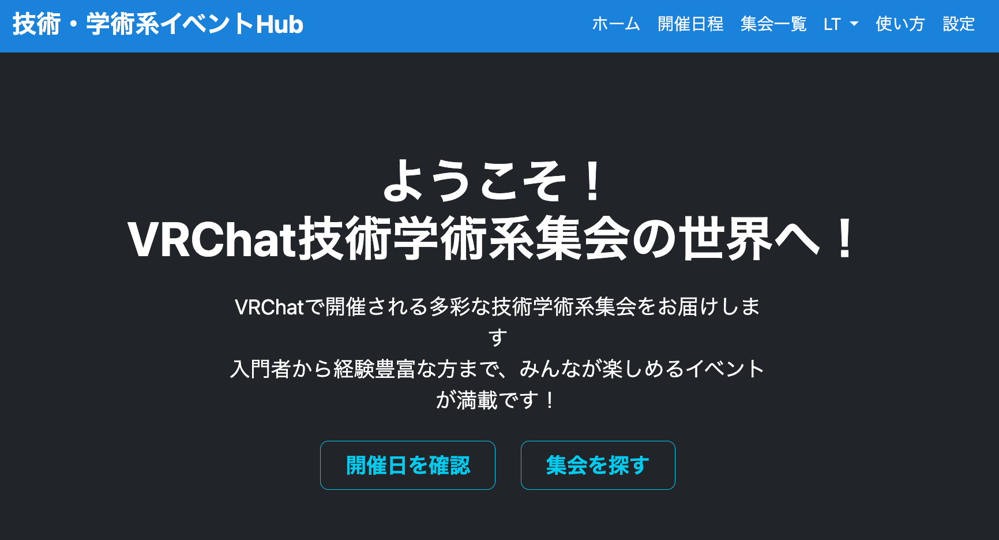

# VRC 技術学術ハブ（VRChat Technology and Academic Hub）

このプロジェクトはVRChatで開催されている技術学術系イベントを知って、参加してもらい、盛り上げていくためのWeb制作プロジェクトです。



https://vrc-ta-hub.com

## 概要

VRChat技術学術ハブは、VRChat内で開催される技術・学術系イベントの情報を集約し、利用者が簡単にイベントの情報にアクセスできるようにするためのWebサイトです。

## 主な機能

1. **ホームページ（ランディングページ）:**
    - プロジェクトの概要と主要な機能について説明します。

2. **開催日程ページ:**
    - GoogleカレンダーをAPIで埋め込み、今後開催予定のイベントをカレンダー形式で表示します。
    - 各イベントの詳細情報へのリンクを提供します。

3. **集会一覧ページ:**
    - これまでに開催された全てのイベントをリスト形式で表示します。
    - 検索（フィルター）機能を実装し、ユーザーが関心のあるイベントを見つけやすくします。
    - 各イベントの詳細ページへのリンクを提供します。

4. **集会詳細ページ:**
    - 各イベントの詳細情報を提供します。
    - イベントの概要、開催日時、登壇者、関連資料などの情報を掲載します。
    - 各回のイベントで行われたライトニングトークの資料やYouTube動画を埋め込みます。

5. **LTアーカイブページ:**
    - 過去に開催されたライトニングトークの資料やYouTube動画を一覧で表示します。
    - 各資料や動画へのリンクを提供します。

6. **ユーザーアカウント:**
    - イベント主催者はアカウントを作成し、集会情報とイベント情報を登録・管理できます。
    - 承認機能により、新規登録された集会は管理者または既存の承認済み集会運営者によって承認されるまで公開されません。
    - 設定画面では、ユーザーは自身のプロフィール情報、集会情報、パスワードなどを変更できます。


7. **API (api/v1):**
    - WebサイトのデータはRESTful APIを通して取得できます。
    - APIはJSON形式でデータを提供します。
    - APIを通して、集会情報、イベント情報、イベント詳細情報などを取得可能です。
    - APIドキュメントは[こちら](https://vrc-ta-hub.com/api/v1/)からアクセスできます。

## API エンドポイント

VRC技術学術ハブは、以下のAPIエンドポイントを提供しています：

1. **集会情報 API:**
    - エンドポイント: `http://vrc-ta-hub.com/api/v1/community/`
    - 説明: 全ての集会の情報を取得します。

2. **イベント情報 API:**
    - エンドポイント: `http://vrc-ta-hub.com/api/v1/event/`
    - 説明: 全てのイベントの情報を取得します。

3. **イベント詳細情報 API:**
    - エンドポイント: `http://vrc-ta-hub.com/api/v1/event_detail/`
    - 説明: 全てのイベント詳細（ライトニングトークなど）の情報を取得します。

各APIエンドポイントは、GET、HEAD、OPTIONSメソッドをサポートしています。レスポンスはJSON形式で返されます。

詳細な使用方法や各エンドポイントの具体的なレスポンス形式については、[APIドキュメント](https://vrc-ta-hub.com/api/v1/)
を参照してください。

## 使用技術

- Django（Python）
- Bootstrap 5.3
- SQLite (開発用)
- MySQL (本番用)
- Google Calendar API
- Google Gemini API
- django_filters
- djangorestframework
- youtube_transcript_api
- google-generativeai
- bleach
- markdown

## 開発環境構築

### 前提条件

- Python 3.9以上
- Docker
- Docker Compose

### 手順

1. **リポジトリのクローン:**

   ```bash
   git clone https://github.com/noricha-vr/vrc-ta-hub.git
   cd vrc-ta-hub
   ```

2. **.envファイルの作成:**

   ```bash
   cp .env.example .env
   ```

   `.env` ファイルを編集し、必要な環境変数を設定します。

3. **Dockerコンテナのビルドと起動:**

   ```bash
   docker compose up -d --build
   ```

4. **データベースのマイグレーション:**

   ```bash
   docker compose exec vrc-ta-hub python manage.py migrate
   ```

5. **スーパーユーザーの作成:**

   ```bash
   docker compose exec vrc-ta-hub python manage.py createsuperuser
   ```

   指示に従って、スーパーユーザーのユーザー名、メールアドレス、パスワードを設定します。

6. **開発サーバーへのアクセス:**

   ブラウザで `http://localhost:8000` にアクセスします。

## データモデル

1. **集会モデル:**
    - 集会の基本情報を管理します。
    - フィールド：名称、概要、開催頻度、開催場所、主催者、タグ、対応プラットフォームなど

2. **イベントモデル:**
    - 各回のイベントの情報を管理します。
    - フィールド：集会（外部キー）、開催日時、曜日など
    - 集会モデルとの1対多の関係を持ちます。

3. **イベント詳細モデル:**
    - 各イベントのライトニングトークの詳細情報を管理します。
    - フィールド：イベント（外部キー）、開始時刻、発表時間、発表者、テーマ、資料、YouTube動画のURLなど
    - イベントモデルとの1対多の関係を持ちます。

## 開発への貢献

本プロジェクトはGitHubで公開されています。開発への貢献を歓迎します！

- [https://github.com/noricha-vr/vrc-ta-hub](https://github.com/noricha-vr/vrc-ta-hub)
