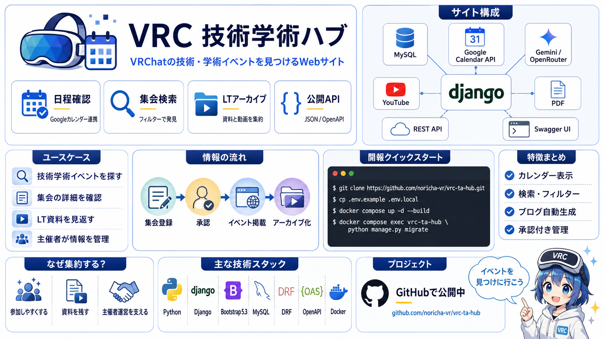

# VRC 技術学術ハブ（VRChat Technology and Academic Hub）

[](https://deepwiki.com/noricha-vr/vrc-ta-hub)

このプロジェクトはVRChatで開催されている技術学術系イベントを知って、参加してもらい、盛り上げていくためのWeb制作プロジェクトです。



https://vrc-ta-hub.com

## ドキュメント

このプロジェクトのドキュメントは **DeepWiki** で閲覧できます。

**[DeepWiki - VRC技術学術ハブ](https://deepwiki.com/noricha-vr/vrc-ta-hub)**

### DeepWikiとは

DeepWikiは、GitHubリポジトリのコードを自動解析し、AIが生成した対話可能なドキュメントを提供するサービスです。コードの構造やアーキテクチャを視覚的に理解でき、チャットで質問することもできます。

### アクセス方法

1. 上記の「DeepWiki」バッジ（青いボタン）をクリック
2. または直接リンク: https://deepwiki.com/noricha-vr/vrc-ta-hub

### DeepWikiでできること

- **アーキテクチャ図の閲覧**: システム構成やデータフローを視覚的に確認
- **コード解説の閲覧**: 各モジュールの役割と実装の詳細を確認
- **AIチャットで質問**: 「このプロジェクトの認証はどう実装されている？」などの質問が可能
- **コード検索**: 特定の機能やクラスの実装箇所を素早く発見

## 概要

VRChat技術学術ハブは、VRChat内で開催される技術・学術系イベントの情報を集約し、利用者が簡単にイベントの情報にアクセスできるようにするためのWebサイトです。

## 主な機能

1. **ホームページ（ランディングページ）:**
    - プロジェクトの概要と主要な機能について説明します。

2. **開催日程ページ:**
    - GoogleカレンダーをAPIで埋め込み、今後開催予定のイベントをカレンダー形式で表示します。
    - 各イベントの詳細情報へのリンクを提供します。

3. **集会一覧ページ:**
    - これまでに開催された全てのイベントをリスト形式で表示します。
    - 検索（フィルター）機能を実装し、ユーザーが関心のあるイベントを見つけやすくします。
    - 各イベントの詳細ページへのリンクを提供します。

4. **集会詳細ページ:**
    - 各イベントの詳細情報を提供します。
    - イベントの概要、開催日時、登壇者、関連資料などの情報を掲載します。
    - 各回のイベントで行われた発表の資料やYouTube動画を埋め込みます。

5. **発表アーカイブページ:**
    - 過去に開催された発表の資料やYouTube動画を一覧で表示します。
    - 各資料や動画へのリンクを提供します。

6. **ユーザーアカウント:**
    - イベント主催者はアカウントを作成し、集会情報とイベント情報を登録・管理できます。
    - 承認機能により、新規登録された集会は管理者または既存の承認済み集会運営者によって承認されるまで公開されません。
    - 設定画面では、ユーザーは自身のプロフィール情報、集会情報、パスワードなどを変更できます。

7. **自動コンテンツ生成機能:**
    - Google Gemini APIとOpenRouter APIを使用して、イベント情報からブログ記事を自動生成します。
    - YouTube動画の文字起こしとPDFスライドの内容を分析し、イベント内容を要約します。
    - メタディスクリプションやタイトルを自動生成し、SEO最適化を支援します。

8. **API (api/v1):**
    - WebサイトのデータはRESTful APIを通して取得できます。
    - APIはJSON形式でデータを提供します。
    - 読み取り専用の公開APIと、認証が必要な管理APIの両方を提供しています。
    - Swagger UIによる対話的なAPIドキュメントを提供しています。

## API エンドポイント

### 公開API（認証不要）

読み取り専用のAPIエンドポイント：

1. **集会情報 API:**
    - エンドポイント: `https://vrc-ta-hub.com/api/v1/community/`
    - 説明: 承認済み集会の情報を取得します。

2. **イベント情報 API:**
    - エンドポイント: `https://vrc-ta-hub.com/api/v1/event/`
    - 説明: 今後開催予定のイベント情報を取得します。

3. **イベント詳細情報 API:**
    - エンドポイント: `https://vrc-ta-hub.com/api/v1/event_detail/`
    - 説明: 公開されているイベント詳細（発表など）の情報を取得します。

4. **TaAGatheringListSys向け JSON API:**
    - エンドポイント: `https://vrc-ta-hub.com/api/v1/community/gathering-list/`
    - 説明: VRChat ワールド内アセットがそのまま読み込める既存 `sample.json` 互換形式で、アクティブな技術系・学術系集会の一覧を取得します。

### 管理API（認証必要）

イベント詳細の作成・編集・削除が可能なAPIエンドポイント：

- エンドポイント: `https://vrc-ta-hub.com/api/v1/event-details/`
- 認証方法: APIキー認証（Bearer Token）またはセッション認証
- 権限: コミュニティオーナーは自分のイベントのみ、管理者は全イベントを操作可能

#### APIキーの取得方法

1. [アカウント設定](https://vrc-ta-hub.com/account/settings/)にログイン
2. 「API管理」セクションから「APIキー管理」ページへ移動
3. 新規APIキーを作成（キーは一度しか表示されません）

#### リクエスト例

```bash
# イベント詳細の作成
curl -X POST \
  -H "Authorization: Bearer YOUR_API_KEY" \
  -H "Content-Type: application/json" \
  -d '{
    "event": 1,
    "detail_type": "LT",
    "speaker": "発表者名",
    "theme": "発表テーマ",
    "start_time": "20:00:00",
    "duration": 30,
    "generate_from_pdf": true
  }' \
  https://vrc-ta-hub.com/api/v1/event-details/
```

### APIドキュメント

- **Swagger UI**: [https://vrc-ta-hub.com/api/docs/](https://vrc-ta-hub.com/api/docs/)
- **ReDoc**: [https://vrc-ta-hub.com/api/redoc/](https://vrc-ta-hub.com/api/redoc/)
- **OpenAPIスキーマ**: [https://vrc-ta-hub.com/api/schema/](https://vrc-ta-hub.com/api/schema/)

Swagger UIでは、APIをブラウザから直接テストすることができます。

## 使用技術

- Django（Python）
- Bootstrap 5.3
- SQLite (開発用)
- MySQL (本番用)
- Google Calendar API
- Google Gemini API
- OpenRouter API
- YouTube Data API
- django_filters
- djangorestframework
- drf-spectacular（OpenAPI/Swagger対応）
- youtube_transcript_api
- openai（OpenRouterとの互換クライアント）
- PyPDF（PDFファイルの解析）
- bleach
- markdown
- pydantic

## 開発者向けセットアップ

リポジトリをクローンしたら、コミット前 lint 自動化のため pre-commit hook を有効化してください。

```bash
pip install pre-commit==4.0.1
pre-commit install
```

これで `git commit` 実行時に ruff check / 行末空白 / 末尾改行 / YAML 構文 / マージコンフリクト / 巨大ファイルなどが自動チェックされ、
CI lint 失敗をローカルで先に検出できます。全ファイルに対する手動実行は以下:

```bash
pre-commit run --all-files
```

## 開発環境構築

### 前提条件

- Docker
- Docker Compose

### 構成

docker-compose により以下のコンテナが起動します:

| コンテナ | 説明 | ポート |
|----------|------|--------|
| vrc-ta-hub | Django アプリケーション | 8015 |
| db | MySQL 8.0 | 3306 |
| storage | [RustFS](https://rustfs.com/)（S3互換オブジェクトストレージ） | 9000（API）/ 9001（管理画面） |
| storage-init | storage のバケット初期化（起動時のみ） | - |

RustFS は本番環境の Cloudflare R2 の代替として、画像などのメディアファイルをローカルで保存・配信します。

### セットアップ手順

1. **リポジトリのクローン:**

   ```bash
   git clone https://github.com/noricha-vr/vrc-ta-hub.git
   cd vrc-ta-hub
   ```

2. **`.env.local` の作成:**

   ```bash
   cp .env.example .env.local
   ```

   `SECRET_KEY` に適当な文字列を設定します。DB・ストレージの接続情報はデフォルト値が入っているため、変更不要です。

   #### 初回環境変数セットアップ

   手動で `.env.local` を書く代わりに、自動生成スクリプトも使えます:

   ```bash
   uv run scripts/init_env.py
   # → .env.local を生成。SECRET_KEY/REQUEST_TOKEN は自動生成
   # → API キー (GEMINI_API_KEY, GOOGLE_CALENDAR_ID 等) は手動で埋める
   ```

   既存の `.env.local` を上書きしたい場合は `--force` を、ファイルを書かずに出力だけ確認したい場合は `--dry-run` を指定します。

3. **Dockerコンテナのビルドと起動:**

   ```bash
   docker compose up -d --build
   ```

4. **データベースのマイグレーション:**

   ```bash
   docker compose exec vrc-ta-hub python manage.py migrate
   ```

5. **スーパーユーザーの作成:**

   ```bash
   docker compose exec vrc-ta-hub python manage.py createsuperuser
   ```

6. **開発サーバーへのアクセス:**

   ブラウザで `http://localhost:8015` にアクセスします。

### オプションの環境変数

基本的な開発は上記のセットアップだけで可能です。各機能を利用する場合は `.env.local` に以下を設定してください:

| 環境変数 | 機能 | 取得先 |
|----------|------|--------|
| `GOOGLE_API_KEY` / `GOOGLE_CALENDAR_ID` | カレンダー同期 | [GCP Console](https://console.cloud.google.com/) |
| `GEMINI_API_KEY` | AIコンテンツ自動生成 | [Google AI Studio](https://aistudio.google.com/) |
| `OPENROUTER_API_KEY` | AI処理のバックアップ | [OpenRouter](https://openrouter.ai/) |
| `DISCORD_CLIENT_ID` / `DISCORD_CLIENT_SECRET` | Discordログイン | [Discord Developer Portal](https://discord.com/developers/applications) |
| `REQUEST_TOKEN` | カレンダー同期APIの認証 | 任意の文字列 |

詳細は [docs/setup.md](docs/setup.md) を参照してください。

### 依存パッケージ管理

サプライチェーン攻撃と間接依存の minor update による予期せぬ breaking change を防ぐため、
直接依存とロックファイルを 2 段構えで管理しています。

| ファイル | 役割 | 更新方法 |
|----------|------|----------|
| `requirements.txt` | 直接依存（人間が編集） | パッケージ追加時はバージョン固定必須（例: `django==5.2.14`） |
| `requirements.lock` | 間接依存を含む全ピン（自動生成） | `uv pip compile requirements.txt -o requirements.lock` |

#### パッケージを追加・更新する

1. `requirements.txt` に `==` でバージョン固定して追記
2. ロックファイルを再生成

   ```bash
   uv pip compile requirements.txt -o requirements.lock
   ```

3. `requirements.txt` と `requirements.lock` を同じコミットに含める

#### 本番 / CI で使う

本番（Dockerfile）と CI（GitHub Actions）は `requirements.lock` を使ってインストールします。

```bash
# CI（uv 経由・lock を厳密に同期）
uv pip sync --system requirements.lock

# ローカル開発で lock を厳密に再現したい場合
uv pip sync requirements.lock
```

`requirements.lock` には間接依存のバージョンもすべて固定されているため、
ビルドのたびに依存解決が走らず、誰がどの環境でビルドしても同じ依存ツリーになります。

### テスト環境のセットアップ

通常suiteは外向き通信を遮断するため、実credentialなしで実行できます。実サービスへ接続する
テストは通常suiteから除外し、固定 `live_smoke` profileを明示した場合だけ専用containerで
実行します。

1. **通常suiteの実行:**

   ```bash
   # 全通常テスト。live smoke / browser E2Eを除外し、外向き通信を拒否する
   scripts/run_tests.sh

   # 特定のテストも同じoffline境界で実行する
   scripts/run_tests.sh event.tests.test_generate_blog
   scripts/run_tests.sh api_v1.tests.test_event_detail_api
   ```

2. **live smokeの実行（必要な場合のみ）:**

   実credentialは固定profileが要求するキーだけを現在のshell、またはgit管理外の
   `.env.local` / `LIVE_SMOKE_ENV_FILE` から読み、clean-envの専用Composeへ渡します。

   ```bash
   scripts/run_tests.sh --live-smoke openrouter

   LIVE_SMOKE_ENV_FILE="$HOME/.config/vrc-ta-hub/live-smoke.env" \
     scripts/run_tests.sh --live-smoke google-calendar
   ```

   `google-calendar` profileのJSON鍵はrepositoryとDocker build contextの外に置き、
   `GOOGLE_CALENDAR_CREDENTIALS` にabsolute pathを設定します。鍵は専用containerへread-only
   mountされ、imageには含まれません。

利用可能なprofile、必要credential、既定test label、通信遮断の仕様は
[テスト方針](docs/testing.md)を参照してください。

## データモデル

1. **集会モデル:**
    - 集会の基本情報を管理します。
    - フィールド：名称、概要、開催頻度、開催場所、主催者、タグ、対応プラットフォームなど

2. **イベントモデル:**
    - 各回のイベントの情報を管理します。
    - フィールド：集会（外部キー）、開催日時、曜日など
    - 集会モデルとの1対多の関係を持ちます。

3. **イベント詳細モデル:**
    - 各イベントの発表の詳細情報を管理します。
    - フィールド：イベント（外部キー）、開始時刻、発表時間、発表者、テーマ、資料、YouTube動画のURL、自動生成コンテンツなど
    - イベントモデルとの1対多の関係を持ちます。
    - タイプ（LT、特別企画、ブログ）による分類をサポートします。

4. **APIキーモデル:**
    - API認証用のキーを管理します。
    - ユーザーごとに複数のAPIキーを作成可能です。
    - 最終使用日時の追跡機能を持ちます。

## 実装の特徴

### JSONパーシングの堅牢性向上

外部APIとの連携時に発生するJSONパーシングの問題に対応するため、以下の工夫を施しています：

1. **正規表現を使用したJSON正規化**:
   ```python
   normalized_json = re.sub(r'\\(?!["\\/bfnrtu])', r'\\\\', json_str)
   ```

2. **不正なエスケープシーケンスの処理**:
   ```python
   clean_json = re.sub(r'\\([^"\\/bfnrtu])', r'\1', json_str)
   ```

3. **複数のフォールバック機構**:
   - 正規化されたJSONでパースを試行
   - 失敗した場合はクリーニングされたJSONで試行
   - さらに失敗した場合は制御文字を削除したバージョンで試行
   - 最終手段として積極的なクリーニングを実施

これらの対策により、外部APIが返す不正確なJSONに対しても堅牢にデータを抽出できます。

### テスト戦略

1. **Live smoke**:
   - 実際のAPIを使用する疎通テストは通常suiteから分離
   - 固定profileと必要最小限のcredentialを明示した専用containerでのみ実行

2. **Offline contract / 単体テスト**:
   - 基本的な機能の検証
   - mock / fakeで外部連携の契約を検証し、外向き通信を遮断

3. **例外処理に重点**:
   - APIエラーに対する適切な処理
   - フォールバックメカニズムのテスト

## 開発への貢献

本プロジェクトはGitHubで公開されています。開発への貢献を歓迎します！

- [https://github.com/noricha-vr/vrc-ta-hub](https://github.com/noricha-vr/vrc-ta-hub)

コントリビューション方法:

1. リポジトリをフォーク
2. 機能ブランチを作成（`git checkout -b feature/amazing-feature`）
3. 変更をコミット（`git commit -m 'Add some amazing feature'`）
4. ブランチにプッシュ（`git push origin feature/amazing-feature`）
5. プルリクエストを作成

## ライセンス

Apache License 2.0 の下で公開されています。詳細は LICENSE ファイルを参照してください。
