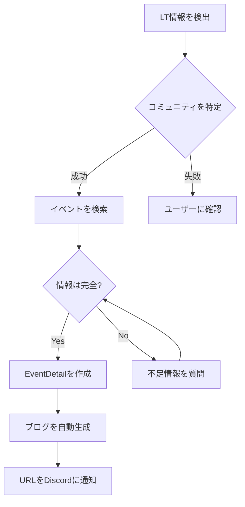
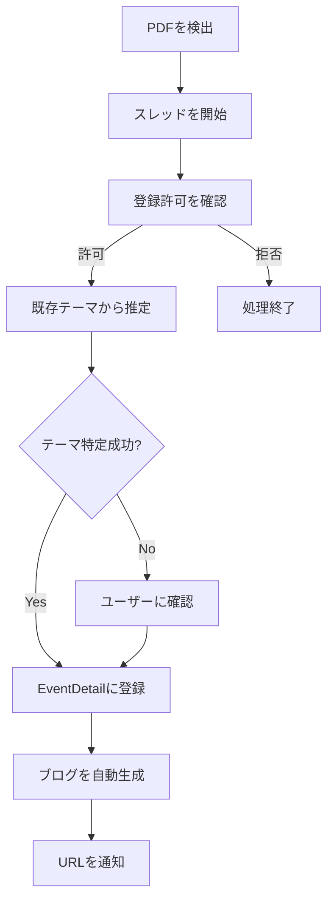

# VRC-TA-Hub Discord Bot 仕様書

## 概要

VRC-TA-Hub Discord Botは、VRChat技術学術コミュニティの情報収集と登録を自動化するボットです。各コミュニティのDiscordサーバーにインストールされ、LT（ライトニングトーク）情報やスライド、YouTube動画を自動的に検出し、データベースに登録します。

## 主要機能

### 1. コミュニティの自動識別
- Discordサーバー名から所属コミュニティを特定
- サーバー名とCommunityモデルの`name`フィールドをマッチング

### 2. LT情報の自動検出と登録
- Discord内でLT情報を検出
- 自然言語処理でイベントとの紐付け
- 必要情報が揃ったらEventDetailとして登録

### 3. スライドファイルの自動登録
- PDFスライドを検出
- スレッドを開いて登録許可を確認
- 既存のEventDetailテーマから該当するものを特定
- ブログ記事を自動生成

### 4. YouTube動画の自動登録
- YouTube URLを検出
- 登録許可を確認後、EventDetailに紐付け
- 文字起こしからブログ記事を自動生成

### 5. 自然言語インターフェース
- ユーザーの自然言語を理解
- 不足情報をインタラクティブに収集
- Discordユーザー名も参考情報として活用

## 技術要件

### 必要な権限
- Discord Bot権限：管理者権限
- API認証：APIキー認証（`Authorization: Bearer {APIキー}`）

### 利用するAPI

#### 1. 読み取り専用API（認証不要）
- **GET /api/v1/community/** - コミュニティ一覧の取得
- **GET /api/v1/community/{id}/** - コミュニティ詳細の取得
- **GET /api/v1/event/** - イベント一覧の取得
- **GET /api/v1/event/{id}/** - イベント詳細の取得

#### 2. CRUD API（認証必要）
- **GET /api/v1/event-details/** - イベント詳細一覧の取得
- **POST /api/v1/event-details/** - 新規イベント詳細の作成
- **PUT /api/v1/event-details/{id}/** - イベント詳細の更新
- **GET /api/v1/event-details/my_events/** - 自分のコミュニティのイベント詳細取得

### 必要な追加APIエンドポイント

以下のエンドポイントの実装が必要です：

#### 1. コミュニティ検索API
```
GET /api/v1/community/search_by_name/
パラメータ: name (完全一致または部分一致)
```

#### 2. イベント検索API  
```
GET /api/v1/event/search_by_community_and_date/
パラメータ: community_id, date
```

#### 3. ブログ生成API
```
POST /api/v1/event-details/{id}/generate_blog/
```

#### 4. Discord Bot用ユーザー作成API
```
POST /api/v1/bot/register_discord_user/
パラメータ: discord_id, discord_username
```

## データモデル

### EventDetailの作成に必要な情報
```python
{
    "event": int,  # Event ID（必須）
    "detail_type": "LT",  # 固定値
    "speaker": str,  # 発表者名（Discordユーザー名から推定）
    "theme": str,  # 発表テーマ（必須）
    "start_time": "HH:MM:SS",  # 開始時刻
    "duration": int,  # 発表時間（分）
    "slide_url": str,  # スライドURL（オプション）
    "slide_file": file,  # PDFファイル（オプション）
    "youtube_url": str,  # YouTube URL（オプション）
}
```

### ブログ自動生成の条件
- `detail_type`が'LT'
- `slide_file`または`youtube_url`が存在
- `meta_description`が空

## 処理フロー

### 1. LT情報登録フロー


### 2. スライド登録フロー


## 実装上の注意点

### 1. エラーハンドリング
- API通信エラー時の再試行機能
- 不正なデータ形式への対応
- 権限エラーの適切な処理

### 2. セキュリティ
- APIキーの安全な管理
- ユーザー権限の確認
- 不正なファイルアップロードの防止

### 3. パフォーマンス
- 大量のメッセージに対する効率的な処理
- API呼び出しの最適化（バッチ処理等）
- キャッシュの活用

### 4. ユーザビリティ
- 分かりやすいエラーメッセージ
- 進捗状況の可視化
- 取り消し機能の実装

## 設定項目

### 環境変数
```env
# Discord Bot設定
DISCORD_TOKEN=your_discord_bot_token
DISCORD_APPLICATION_ID=your_application_id

# VRC-TA-Hub API設定
VRCTAHUB_API_URL=https://vrc-ta-hub.com/api/v1
VRCTAHUB_API_KEY=your_api_key

# LLM設定
OPENROUTER_API_KEY=your_openrouter_api_key
GEMINI_MODEL=google/gemini-2.0-flash-001

# その他
YOUTUBE_API_KEY=your_youtube_api_key
```

### Bot設定ファイル（config.yml）
```yaml
# コミュニティマッピング
community_mapping:
  - discord_server_id: "123456789"
    community_id: 1
    channel_settings:
      lt_channel: "lt-information"
      notification_channel: "general"

# 自動検出設定
detection:
  lt_keywords:
    - "LT"
    - "ライトニングトーク"
    - "発表"
  slide_patterns:
    - "*.pdf"
    - "slides.google.com"
  
# 処理設定
processing:
  auto_approve_threshold: 0.8  # 自動承認の信頼度閾値
  max_file_size_mb: 50
  supported_languages: ["ja", "en"]
```

## 今後の拡張予定

1. **マルチ言語対応**
   - 英語コミュニティへの対応
   - 自動翻訳機能

2. **高度な分析機能**
   - 発表内容の自動タグ付け
   - 関連発表の推薦

3. **統計・レポート機能**
   - コミュニティ活動レポート
   - 人気トピックの分析

4. **他プラットフォーム連携**
   - Twitter/X自動投稿
   - Slack連携

## 開発スケジュール

### Phase 1: 基本機能実装（2週間）
- Discord Bot基本設定
- コミュニティ識別機能
- 基本的なLT情報登録

### Phase 2: 自動化機能（3週間）
- スライド自動検出・登録
- YouTube動画連携
- ブログ自動生成

### Phase 3: 高度な機能（2週間）
- 自然言語処理の強化
- エラーハンドリングの改善
- パフォーマンス最適化

### Phase 4: テスト・デプロイ（1週間）
- 統合テスト
- セキュリティ監査
- 本番環境デプロイ