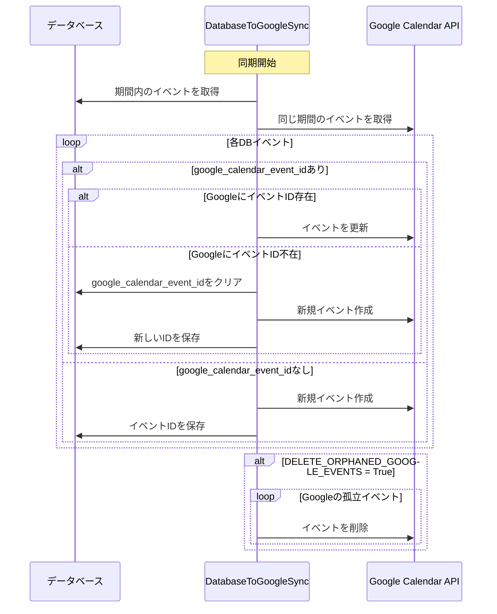

# Googleカレンダー同期システム

## 概要

VRC-TA-HubのイベントデータをGoogleカレンダーに同期するシステムについて説明します。このシステムは、データベースを信頼できる唯一の情報源（Single Source of Truth）として、Googleカレンダーへの単方向同期を実装しています。

⚠️ **最新の修正**: 2025年6月に重複イベント問題が解決されました。詳細は[Googleカレンダー同期問題の解決](google_calendar_sync_issue_resolved.md)を参照してください。

## アーキテクチャ

### 同期方向
- **単方向同期**: データベース → Googleカレンダー
- Googleカレンダー側の変更はデータベースに反映されません

### 主要コンポーネント

#### 1. DatabaseToGoogleSync クラス
- **ファイル**: `app/event/sync_to_google.py`
- **役割**: データベースのイベントをGoogleカレンダーに同期する中核クラス

#### 2. GoogleCalendarService クラス
- **ファイル**: `app/event/google_calendar.py`
- **役割**: Google Calendar APIのラッパー

#### 3. Event モデル
- **ファイル**: `app/event/models.py`
- **重要フィールド**: `google_calendar_event_id` - Googleカレンダー上のイベントIDを保持

## 同期プロセス

### 1. イベントの作成
```python
def _create_google_event(self, event: Event):
    # データベースのイベントから開始・終了時刻を計算
    start_datetime = datetime.combine(event.date, event.start_time)
    end_datetime = start_datetime + timedelta(minutes=event.duration)
    
    # Googleカレンダーにイベントを作成（繰り返しルールなし）
    result = self.service.create_event(
        summary=event.community.name,
        start_time=start_datetime,
        end_time=end_datetime,
        description=description,
        recurrence=None  # 繰り返しルールを無効化
    )
    
    # GoogleカレンダーのイベントIDを保存
    event.google_calendar_event_id = result['id']
    event.save()
```

### 2. イベントの更新
- `google_calendar_event_id`が存在する場合、対応するGoogleイベントを更新
- GoogleカレンダーにイベントがIDが見つからない場合、新規作成にフォールバック

### 3. イベントの削除
- `DELETE_ORPHANED_GOOGLE_EVENTS`設定がTrueの場合のみ実行
- デフォルトではFalse（安全のため削除しない）

## 同期の実行方法

### 1. HTTPエンドポイント経由
```bash
# カレンダー更新エンドポイント
curl -X GET -H "Request-Token: YOUR_REQUEST_TOKEN" https://vrc-ta-hub.com/event/update/
```
- **ファイル**: `app/event/views.py`の`update_google_calendar()`関数
- **認証**: REQUEST_TOKENヘッダーが必要
- **処理内容**: 
  1. Googleカレンダーからイベントを取得
  2. DBにイベントを保存
  3. DBからGoogleカレンダーへの逆同期を実行

### 2. 管理コマンド
```bash
docker compose exec vrc-ta-hub python manage.py sync_calendar
```
- **ファイル**: `app/event/management/commands/sync_calendar.py`

### 3. スクリプト
```bash
# DBからGoogleカレンダーへの同期（推奨）
docker compose exec vrc-ta-hub python scripts/sync_db_to_calendar.py

# 全コミュニティのイベント同期
docker compose exec vrc-ta-hub python scripts/sync_all_events.py
```

## 定期イベント（RecurrenceRule）の扱い

### 現状の実装（2025年6月更新）
- RecurrenceRuleは定義されているが、Googleカレンダー同期では**使用されていない**
- すべてのイベントが個別イベントとしてGoogleカレンダーに作成される
- `recurrence=None`により、繰り返しルールは意図的に無効化
- **理由**: Google Calendar APIの繰り返しイベント機能による重複問題を回避するため

### 定期イベントの生成プロセス
1. `generate_recurring_events`管理コマンドでRecurrenceRuleから個別イベントを生成
2. 生成された個別イベントがデータベースに保存
3. 同期処理により、個別イベントとしてGoogleカレンダーに反映

## 設定

### 必要な環境変数
```python
# settings.py
GOOGLE_CALENDAR_ID = 'your-calendar-id@group.calendar.google.com'
GOOGLE_CALENDAR_CREDENTIALS = '/path/to/credentials.json'
REQUEST_TOKEN = 'your-secret-token'
DELETE_ORPHANED_GOOGLE_EVENTS = False  # デフォルトはFalse
```

### Google Calendar API認証
- **本番環境**: デフォルト認証（GCP環境変数）
- **開発環境**: サービスアカウントのJSONファイル
- **必要なスコープ**: `https://www.googleapis.com/auth/calendar`

## エラーハンドリング

### 現在の実装
- 各イベントの処理は個別にtry-catchでラップ
- エラー時はログ出力し、次のイベントの処理を継続
- 統計情報（created, updated, deleted, errors）を収集

### 制限事項
- 明示的なリトライ機構は実装されていない
- ネットワークエラーや一時的なAPI障害に対する耐性が低い

## 同期フロー図



## 改善提案

### 1. 繰り返しイベントのネイティブサポート
- RecurrenceRuleをGoogle Calendar APIのrecurrenceフィールドにマッピング
- 個別イベントの生成を減らし、効率を向上

### 2. リトライ機構の実装
- exponential backoffを使用した再試行
- 一時的なネットワークエラーへの耐性向上

### 3. 双方向同期のオプション
- Googleカレンダー側の変更をデータベースに反映
- WebhookやPollingによる実装

### 4. バッチ処理の最適化
- Google Calendar APIのバッチリクエスト機能を活用
- API呼び出し回数の削減

## 関連ファイル

- `app/event/sync_to_google.py` - メイン同期ロジック
- `app/event/google_calendar.py` - Google Calendar APIラッパー
- `app/event/views.py` - HTTP同期エンドポイント
- `app/event/management/commands/sync_calendar.py` - 管理コマンド
- `app/event/management/commands/generate_recurring_events.py` - 定期イベント生成
- `app/event/models.py` - Event, RecurrenceRuleモデル
- `app/scripts/sync_db_to_calendar.py` - DBからGoogleカレンダーへの同期
- `app/scripts/sync_all_events.py` - 同期スクリプト

## トラブルシューティング

### 重複イベントの確認
```bash
# Googleカレンダー上の重複をチェック
docker compose exec vrc-ta-hub python scripts/check_calendar_duplicates.py

# 特定コミュニティのイベントを確認
docker compose exec vrc-ta-hub python scripts/check_specific_community.py
```

### デバッグログの有効化
```python
# settings.pyでDEBUG=Trueを設定すると詳細ログが出力されます
```
